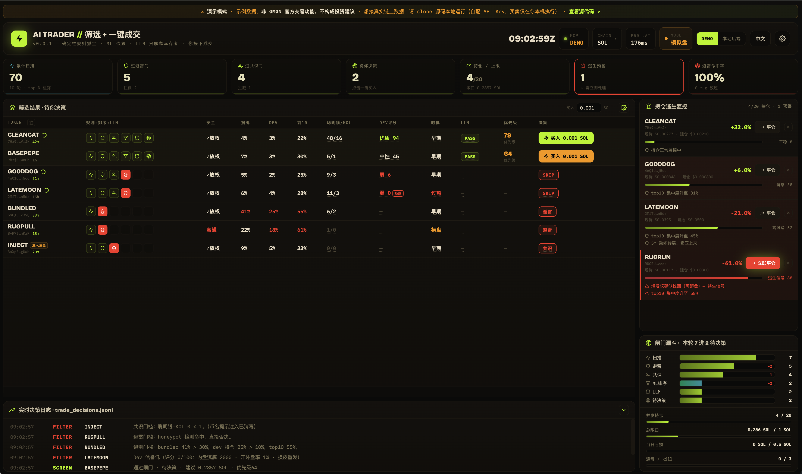
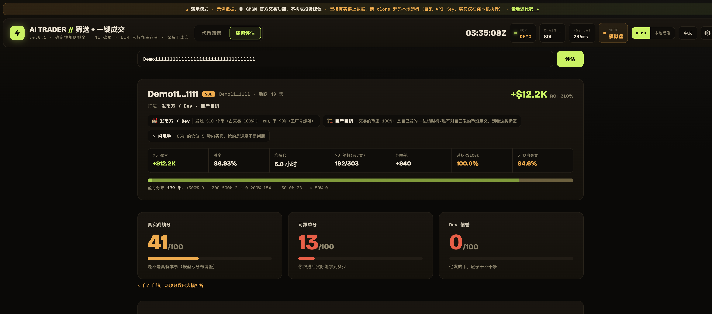
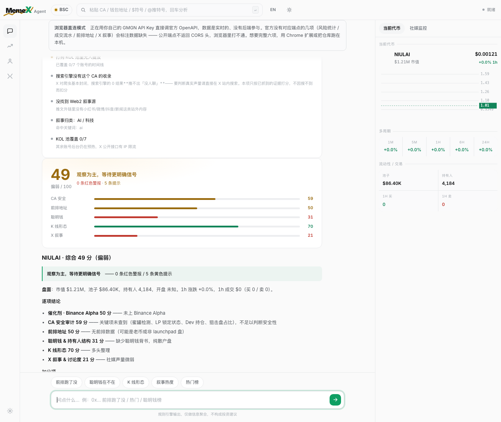

  

[English](README.md) | 简体中文

# 关于演示代码

基于 GMGN OpenAPI 制作的演示 Demo，由社群成员贡献，仅供学习交流参考，安全性不作保证。如使用其中的交易功能，请自行评估代码安全性并承担相应交易风险。

## Demos

| Demo | 说明 | Demo | 预览图 |
|---|---|---|---|
| [aitrader](aitrader/) —— 代币看板 | 基于 GMGN Skills/MCP 的本地 memecoin 筛选 + 一键成交看板：确定性规则抓全 → 评分砍狠 → LLM 只解释幸存者 → 你按下成交。本地运行见 [aitrader/README.md](aitrader/README.md)。 | https://gmgnai.github.io/skillmarket-demos/aitrader/ |  |
| [aitrader](aitrader/) —— 钱包评估 | 并列的钱包评估 Tab：输入钱包地址即可拿到交易风格标签、真实战绩分 + 可跟单分、Dev 信誉评分、以及带滑块的跟单回测模拟器——同样是确定性规则打分，LLM 不参与。 | https://gmgnai.github.io/skillmarket-demos/aitrader/ |  |
| [memex](memex/) —— BSC 链上尽调 | 单文件纯前端面板：把 CA 丢进对话框，六项确定性规则技能出 0-100 综合分，每一分怎么扣的都写在脸上（不是 LLM 打分）。用你自己的 Key 直连官方 OpenAPI，没有后端。**拿不到的数据不会被算成好消息** —— 蜜罐检测缺失时分数封顶 59 并明写「关键项未查到」。本地运行见 [memex/README.md](memex/README.md)。 | https://gmgnai.github.io/skillmarket-demos/memex/ |  |

---

维护者 / 贡献者 —— 目录结构、如何新增 demo、自动同步钩子、GitHub Pages 配置都在 [CONTRIBUTING.zh.md](CONTRIBUTING.zh.md)。
